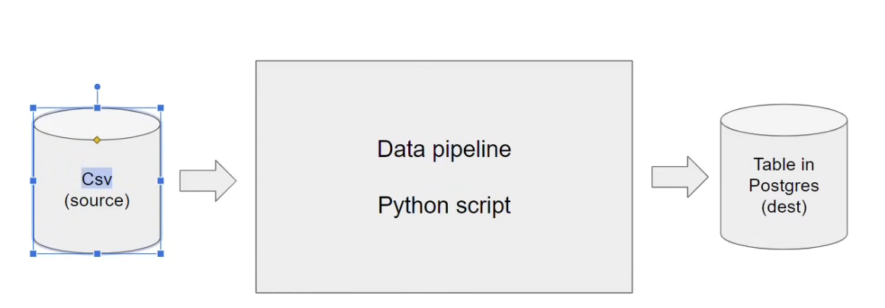
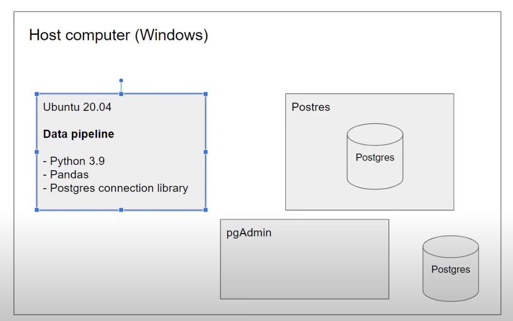
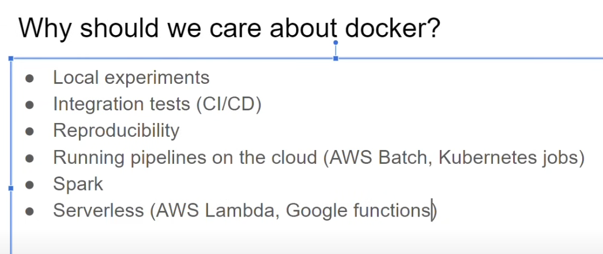
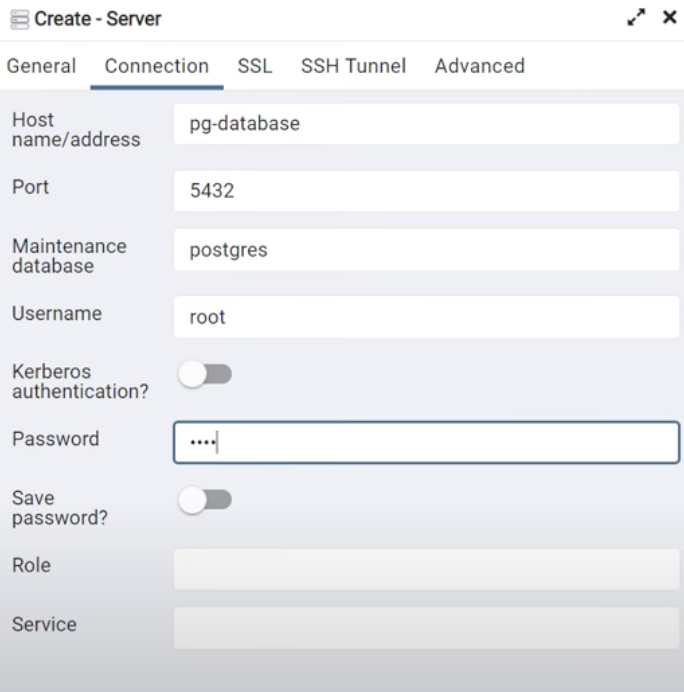
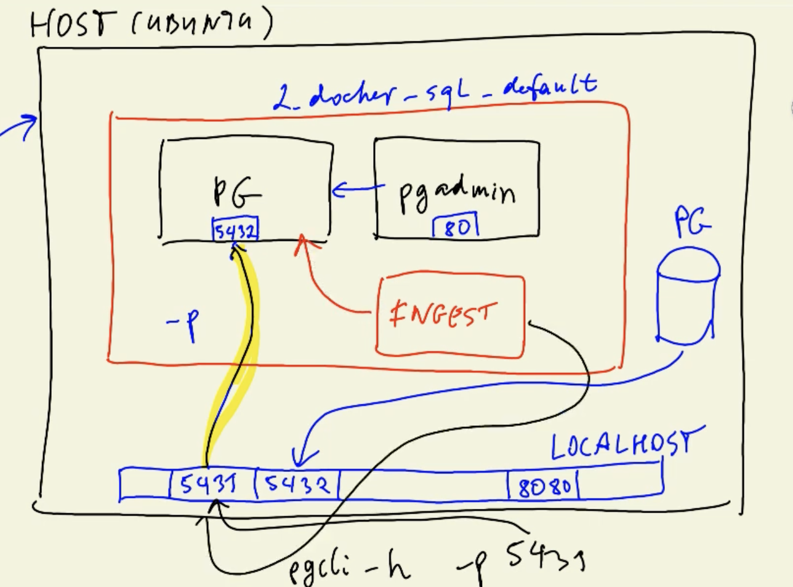
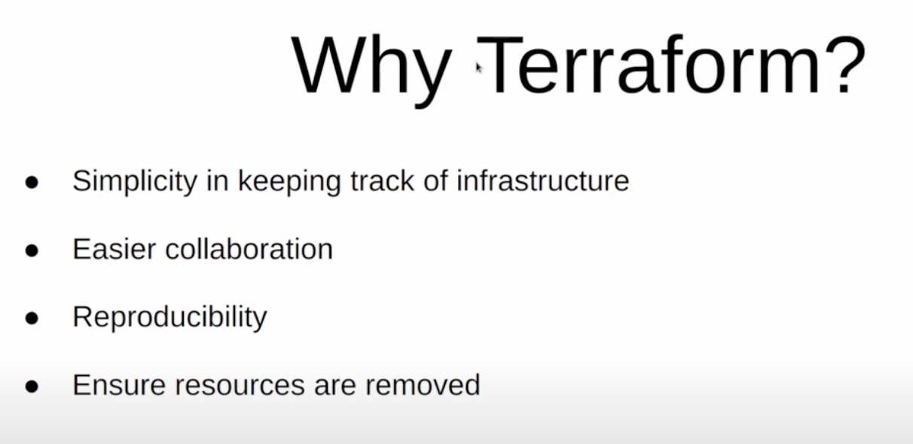
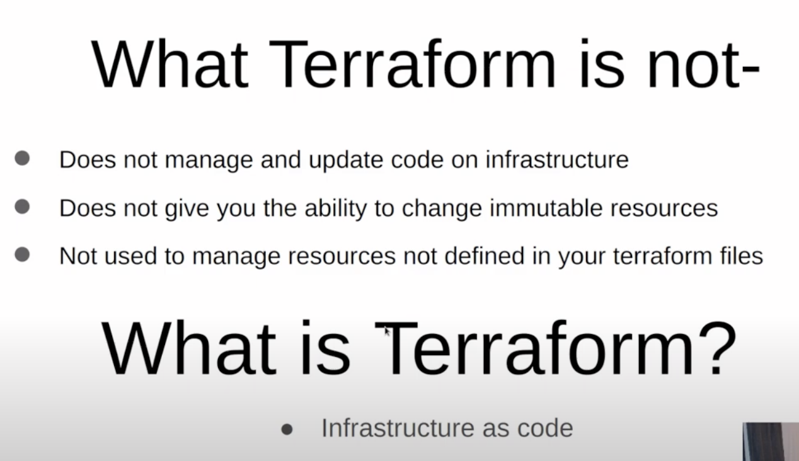
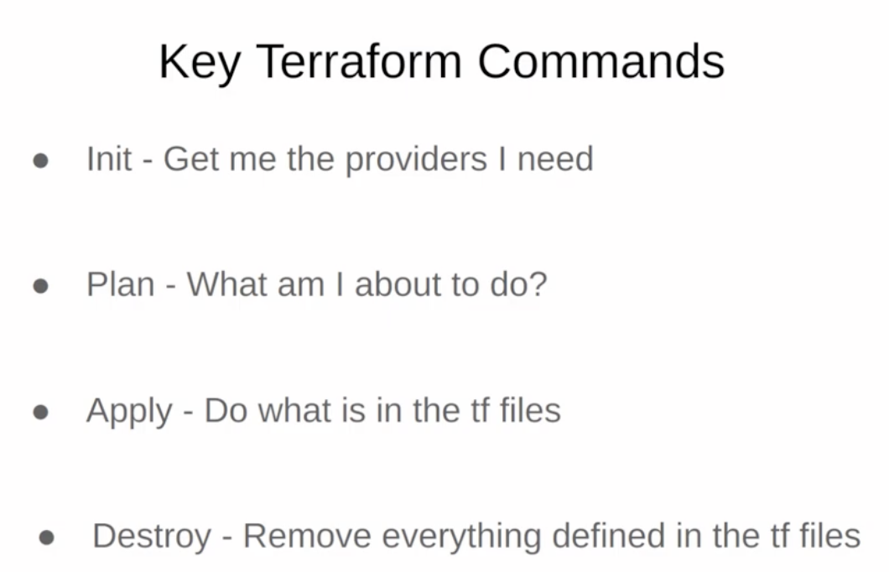
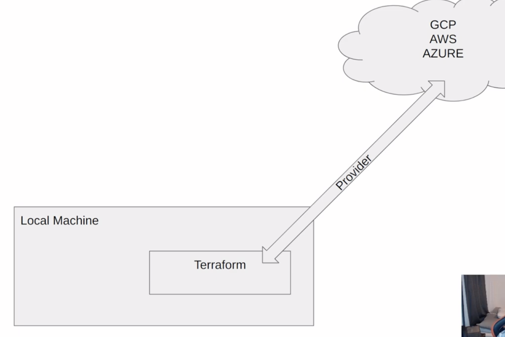

# Module 1: Docker - Terraform

### HW1 - Docker  & SQL Part

- **Question 3. Trip Segmentation Count**
    
    During the period of October 1st 2019 (inclusive) and November 1st 2019 (exclusive), how many trips, **respectively**, happened:
    
    1. Up to 1 mile
        
        ```sql
        SELECT 
        	COUNT(*)
        FROM green_taxi_data
        WHERE 
        	CAST(lpep_pickup_datetime AS DATE) >= '2019-10-01'
        	AND	CAST(lpep_pickup_datetime AS DATE) < '2019-11-01'
        	AND trip_distance <= 1.0
        	AND trip_distance is NOT NULL;
        ```
        
    2. In between 1 (exclusive) and 3 miles (inclusive),
        
        198995
        
    3. In between 3 (exclusive) and 7 miles (inclusive),
        
        109642
        
    4. In between 7 (exclusive) and 10 miles (inclusive),
        
        27686
        
    5. Over 10 miles
        
        35201
        
- **Question 4. Longest trip for each day**
    
    Which was the pick up day with the longest trip distance? Use the pick up time for your calculations.
    
    Tip: For every day, we only care about one single trip with the longest distance.
    
    ```sql
    SELECT 
    	CAST(lpep_pickup_datetime AS DATE) as "day",
    	max(trip_distance) as "max_dist"
    FROM green_taxi_data
    GROUP BY 
    	1
    ORDER BY "max_dist" DESC;
    ```
    
    - 2019-10-31
- **Question 5. Three biggest pickup zones**
    
    Which were the top pickup locations with over 13,000 in `total_amount` (across all trips) for 2019-10-18?
    
    Consider only `lpep_pickup_datetime` when filtering by date.
    
    ```sql
    SELECT 
    	CAST(t.lpep_pickup_datetime AS DATE) AS "day",
    	CONCAT(zpu."Borough", ' / ', zpu."Zone") AS "pickup_loc",
    	SUM(t.total_amount) AS "loc_total_amount"
    FROM 
    	green_taxi_data t 
    	JOIN	taxi_zone_lookup zpu
    		ON t."PULocationID" = zpu."LocationID"
    WHERE
    	CAST(t.lpep_pickup_datetime AS DATE) = '2019-10-18'
    GROUP BY 
    	2, 1
    HAVING 
    	SUM(t.total_amount) > 13000 # 
    ORDER BY "loc_total_amount" DESC;
    ```
    
    - East Harlem North, East Harlem South, Morningside Heights
- **Question 6. Largest tip**
    
    For the passengers picked up in Ocrober 2019 in the zone name "East Harlem North" which was the drop off zone that had the largest tip?
    
    Note: it's `tip` , not `trip`
    
    We need the name of the zone, not the ID.
    
    ```sql
    SELECT 
    	CAST(t.lpep_pickup_datetime AS DATE) AS "day",
    	tip_amount,
    	zpu."Zone" AS "pickup_zone",
    	zdo."Zone" AS "dropoff_zone"
    FROM 
    	green_taxi_data t 
    	JOIN taxi_zone_lookup zpu
    		ON t."PULocationID" = zpu."LocationID"
    	JOIN taxi_zone_lookup zdo
    		ON t."DOLocationID" = zdo."LocationID"
    WHERE
    	CAST(lpep_pickup_datetime AS DATE) >= '2019-10-01'
    	AND	CAST(lpep_pickup_datetime AS DATE) < '2019-11-01'
    	AND zpu."Zone" = 'East Harlem North'
    	AND t.tip_amount != 0
    ORDER BY 
    	tip_amount DESC
    LIMIT 100;
    ```
    
    - JFK Airport

# 1. Environment Setup

### V1 - docker CLI + pgcli

- have a `docker` container running for `Postgres` DB
    
    ```python
    docker run -it \
    -e POSTGRES_USER="root" \
    -e POSTGRES_PASSWORD="root" \
    -e POSTGRES_DB="ny_taxi" \
    -v ./ny_taxi_postgres_data:/var/lib/postgresql/data \
    -p 5432:5432 \
    postgres:13
    ```
    
- have a `pgcli` runing to see what is inside the `Postgres` DB
    
    ```python
    pgcli -h localhost -p 5432 -u root -d ny_taxi
    # Just press Enter when asked for password
    ```
    
- run a script or notebook to ingest data using `sqlalchemy`
    
    ```python
    # connect to the postgresql
    from sqlalchemy import create_engine 
    
    engine = create_engine(f'postgresql://{POSTGRES_USER}:{POSTGRES_PASSWORD}@{host}:{port}/{POSTGRES_DB}')
    engine.conncet()
    
    # Ingest dataframe value
    df.to_sql(name='yellow_taxi_data', con=engine, if_exists='append')
    ```
    

### V2 - docker compose + pgadmin + dockerized python script

- have a `docker compose` network with services including `postgres` and `pgadmin`
    
    ```yaml
    services: # don't need to create network
      pgdatabase:
        image: postgres:13
        environment:
          - POSTGRES_USER=root
          - POSTGRES_PASSWORD=root
          - POSTGRES_DB=ny_taxi
        volumes:
          - "./ny_taxi_postgres_data:/var/lib/postgresql/data:rw"
        ports:
          - "5432:5432"
      pgadmin:
        image: dpage/pgadmin4
        environment:
          - PGADMIN_DEFAULT_EMAIL=admin@admin.com
          - PGADMIN_DEFAULT_PASSWORD=root
        ports:
          - "8080:80"
    ```
    
    ```bash
    docker compose up -d
    ```
    
- open `pgadmin` to inspect `postgresDB` :
    - go to `localhost:8080`
    - connect to `postgresDB` server specified in the YAML file
- run a script in `Docker` container to ingest data using `sqlalchemy`
    
    ```docker
    FROM python:3.9.1
    
    RUN apt-get install wget
    RUN pip install pandas sqlalchemy psycopg2
    
    WORKDIR /app
    COPY ingest_data.py ingest_data.py 
    
    ENTRYPOINT [ "python", "ingest_data.py" ]
    ```
    
    ```bash
    # container for python app
    docker build -t taxi_ingest:v001 .
    
    # add -it to stop it when needed
    # need to do docker kill <container_id>
    docker run -it 
    --network=2_docker_sql_default taxi_ingest:v001 \
    --user=root \
    --password=root \
    --host=pgdatabase \
    --port=5432 \
    --db=ny_taxi \
    --table_name=taxi_zone_lookup \
    --url="https://data.cityofnewyork.us/resource/8meu-9t5y.csv"
    ```
    

## V3 - VM + V2

- GCP
    - Compute engine - VM: setup, gen ssh keys
    - BigQuery
- SSH into VM
    - in bash
        
        ```bash
        ssh de-zoomcamp
        ```
        
        - install `docker.io`, `docker-compose`, `anaconda`, `pgcli` …
        - git clone repo
    - in VScode - Remote-SSH
        - Forward Port to interact with (VM (Docker (`dbpostgres`)))
- other stuffs from V2

## Docker







### Docker Basics

```bash
# Docker daemon pulled the <image-name> image from the Docker Hub
docker run <image-name>

# -it: interactive mode
# bash: parameter execute in this image
docker run -it ubuntu bash

# entry from bash instead of python: to install packages
docker run -it --entrypoint=bash python:3.9

docker ps # show all image running
docker stop <container_id> # Stop the container
docker rm <container_id> # Remove the container

docker compose up -d # "-d" detached mode, otw. need CTRL+C to shut down
docker compose down

exit # exit docker interactive mode or ctrl+D to exit python interactive mode
```

### Build Docker Image from Dockerfile

```bash
# or use **Dockerfile** instead and run
# ".": build docker image in this directory and look for dockerfile here
docker build -t <image-name:version> .
docker run -it <image-name:version>

# run python pipeline in docker image ubuntu bash
python pipeline.py

# run python pipeline.py with argv directly when running a docker image
docker run -it test:pandas 2021-01-15 123
docker run -it <image-name:version> <argv[1]> <argv[2]>
```

```docker
FROM python:3.9

RUN pip install pandas

# WORKDIR <dest-filedir>: do cd to this workdir
WORKDIR /app
# COPY <source-filename> <dest-filename>
COPY pipeline.py pipeline.py

# entry from bash: to run python pipeline.py manually
ENTRYPOINT ["bash"]

# entry from python and execute the pipeline.py using argv
ENTRYPOINT ["python", "pipeline.py"]
```

```python
import sys
import pandas as pd

print(sys.argv)

day = sys.argv[1]

print(f"Job finished suceessfully for day = {day}.")
```

### Connect to PostgreSQL DB from Docker using pgcli

[Pgcli](https://www.pgcli.com/) is a command line interface for Postgres with auto-completion and syntax highlighting.

```bash
docker run -it \
	# "-e": environment
	-e POSTGRES_USER="root" \
	-e POSTGRES_PASSWORD="root" \
	-e POSTGRES_DB="ny_taxi" \
	# "-v": mount volumes from source to dest
	# eg. -v <source-filedir>:<dest-filedir>
	-v ./ny_taxi_postgres_data:/var/lib/postgresql/data \
	# "-p": map a port from host machine to docker image
	-p 5432:5432 \
	# <image-name:version>
	postgres:13
```

```yaml
services:
	postgres:
		image: postgres:13
		environment:
			POSTGRES_USER: root
			POSTGRES_PASSWORD: root
			POSTGRES_DB: ny_taxi
		ports: 
			- "5432:5432"
		volumes:
			- postgres-db-volume: /var/lib/postgresql/data
		healthcheck:
			test: ["CMD", "pg_isready", "-U", "airflow"]
			interval: 5s
			retires: 5
		restart: always
```

```bash
# equal to the left
docker-compose up
```

```bash
# Connect to the database on Docker
# at another terminal
pgcli 
	-h localhost \ # specify host
	-p 5432 \ # specify port
	-u root\ # specify user
	-d ny_taxi \ # specify database

# asked for password: type root
root

# enter database
```

### Upload Downloaded Data to PostgreSQL DB in Docker

Using package sqlalchemy

```python
# connect to the postgresql
from sqlalchemy import create_engine 

engine = create_engine(f'postgresql://{POSTGRES_USER}:{POSTGRES_PASSWORD}@{host}:{port}/{POSTGRES_DB}')
engine.connect()

# Ingest dataframe value
df.to_sql(name='yellow_taxi_data', con=engine, if_exists='append')
```

- upload_data.ipynb: notebook to ingest data
    
    ```python
    ''' connect to the postgresql '''
    from sqlalchemy import create_engine 
    
    engine = create_engine(f'postgresql://{POSTGRES_USER}:{POSTGRES_PASSWORD}@{host}:{port}/{POSTGRES_DB}')
    engine.conncet()
    
    # Inspect all tables in postgresql db
    query = """
    SELECT * 
    	FROM pg_catalog.pg_tables
    	WHERE schemaname != 'pg_catalog' 
    		AND schemaname != 'information_schema';
    """
    pd.read_sql(query, con=engine)
    
    import pandas as pd
    from time import time
    
    ''' read data example '''
    df = pd.read_csv('yellow_tripdata.csv', nrows=100)
    
    print(pd.io.sql.get_schema(df, name='yellow_taxi_data'), \ # check data type
    			con=engine) # specify connection
    			
    # Create table columns and specify types for SQL schema
    df.head(n=0).to_sql(name="yellow_taxi_data", con=engine, if_exist='replace')
    
    # Ingest dataframe value
    %time df.to_sql(name="yellow_taxi_data", con=engine, if_exist='replace')
    
    ''' read all data '''
    df_iter = pd.read_csv('yellow_tripdata.csv', iterator=True, chunksize=100000)
    while True:
    	t_start = time()
    	df = next(df_iter)
    
    	df.ptpepe_pickup_datetime = d.to_datetime(df.tpepe_pickup_datetime) # convert TEXT type to Datetime type
    	df.ptpepe_dropoff_datetime = d.to_datetime(df.tpepe_dropoff_datetime)
    	
    	df.to_sql(name="yellow_taxi_data", con=engine, if_exist='append')
    	t_end = time()
    	
    	print('inserted another chunk..., took %.3f second' % (t_end - t_start))
    ```
    

### Visualize PostgreSQL DB using pgAdmin and Docker Network

[pgAdmin](https://www.pgadmin.org/download/pgadmin-4-container/) is a web based administration tool for the PostgreSQL database.

```bash
docker network create pg-network
```

```bash
docker run -it \
  -e POSTGRES_USER="root" \
  -e POSTGRES_PASSWORD="root" \
  -e POSTGRES_DB="ny_taxi" \
  -v ./ny_taxi_postgres_data:/var/lib/postgresql/data:rw \
  -p "5432:5432" \
  --network=pg-network \
  --name pg-database \
  postgres:13
```

```bash
docker run -it \
  -e PGADMIN_DEFAULT_EMAIL="admin@admin.com" \
  -e PGADMIN_DEFAULT_PASSWORD="root" \
  -p "8080:80" \
  --network=pg-network \
  --name pgadmin \
  dpage/pgadmin4
```

```yaml
services: # don't need to create network
  pgdatabase:
    image: postgres:13
    environment:
      - POSTGRES_USER=root
      - POSTGRES_PASSWORD=root
      - POSTGRES_DB=ny_taxi
    volumes:
      - "./ny_taxi_postgres_data:/var/lib/postgresql/data:rw"
    ports:
      - "5432:5432"
  pgadmin:
    image: dpage/pgadmin4
    environment:
      - PGADMIN_DEFAULT_EMAIL=admin@admin.com
      - PGADMIN_DEFAULT_PASSWORD=root
    ports:
      - "8080:80"
```

```bash
docker compose up -d
```

- the volume: ./ny_taxi_postgres_data is created when docker container run
- the host name is the name specified by each container here

- within pgAdmin, do
    
    servers → <server-name> 
    
    → Databases → <DB-name:ny_taxi> 
    
    → Schemas → public 
    
    → Tables → <df-name:yellow_taxi_data>
    



python app to ingest data

- ingest_data.py: example using argparse to parse parameters
    
    ```python
    #!/usr/bin/env python
    # coding: utf-8
    
    import os
    import argparse
    
    from time import time
    
    import pandas as pd
    from sqlalchemy import create_engine
    
    def main(params):
        user = params.user
        password = params.password
        host = params.host 
        port = params.port 
        db = params.db
        table_name = params.table_name
        url = params.url
        
        # the backup files are gzipped, and it's important to keep the correct extension
        # for pandas to be able to open the file
        if url.endswith('.csv.gz'):
            csv_name = 'output.csv.gz'
        else:
            csv_name = 'output.csv'
    
        os.system(f"wget {url} -O {csv_name}")
    
        engine = create_engine(f'postgresql://{user}:{password}@{host}:{port}/{db}')
    
        df_iter = pd.read_csv(csv_name, iterator=True, chunksize=100000)
    
        df = next(df_iter)
    
        df.tpep_pickup_datetime = pd.to_datetime(df.tpep_pickup_datetime)
        df.tpep_dropoff_datetime = pd.to_datetime(df.tpep_dropoff_datetime)
    
        df.head(n=0).to_sql(name=table_name, con=engine, if_exists='replace')
    
        df.to_sql(name=table_name, con=engine, if_exists='append')
    
        while True: 
    
            try:
                t_start = time()
                
                df = next(df_iter)
    
                df.tpep_pickup_datetime = pd.to_datetime(df.tpep_pickup_datetime)
                df.tpep_dropoff_datetime = pd.to_datetime(df.tpep_dropoff_datetime)
    
                df.to_sql(name=table_name, con=engine, if_exists='append')
    
                t_end = time()
    
                print('inserted another chunk, took %.3f second' % (t_end - t_start))
    
            except StopIteration:
                print("Finished ingesting data into the postgres database")
                break
    
    if __name__ == '__main__':
        parser = argparse.ArgumentParser(description='Ingest CSV data to Postgres')
    
        parser.add_argument('--user', required=True, help='user name for postgres')
        parser.add_argument('--password', required=True, help='password for postgres')
        parser.add_argument('--host', required=True, help='host for postgres')
        parser.add_argument('--port', required=True, help='port for postgres')
        parser.add_argument('--db', required=True, help='database name for postgres')
        parser.add_argument('--table_name', required=True, help='name of the table where we will write the results to')
        parser.add_argument('--url', required=True, help='url of the csv file')
    
        args = parser.parse_args()
    		
        main(args) # pass args into this main block 
    ```
    
- to download data: either way

```bash
URL="https://s3.amazonaws.com/nyc-tlc/trip+data/yellow_tripdata_2021-01.csv
```

```bash
# Download from localhost
python -m http.server 8000 # http server for files in dir
URL="http://host.docker.internal:8000/taxi_zone_lookup.csv"
```

- to run python script: either way

```bash
python ingest_data.py \
    --user=root \
    --password=root \
    --host=localhost \
    --port=5432 \
    --db=ny_taxi \
    --table_name=yellow_taxi_trips \
    --url="https://s3.amazonaws.com/nyc-tlc/trip+data/yellow_tripdata_2021-01.csv"
```

- using docker compose:
    - network=<filedir_default>
    - host=pgdatabase



```docker
FROM python:3.9.1

RUN apt-get install wget
RUN pip install pandas sqlalchemy psycopg2

WORKDIR /app
COPY ingest_data.py ingest_data.py 

ENTRYPOINT [ "python", "ingest_data.py" ]
```

```bash
# container for python app
docker build -t taxi_ingest:v001 .

# add -it to stop it when needed
# need to do docker kill <container_id>
docker run -it 
		--network=pg-network \
		taxi_ingest:v001 \
		--user=root \
    --password=root \
    # find pg-database in pg-network
    --host=pg-database \ 
    --port=5432 \ 
    --db=ny_taxi \
    --table_name=yellow_taxi_trips \
    --url=${URL}
```

## Set Up GCP

1. Create ssh keys for GCP
    1. create a directory: ~/.ssh and cd there
    2. create ssh keys
        
        ```bash
        ssh-keygen -t rsa -f ~/.ssh/KEY_FILENAME -C USERNAME
        ```
        
    3. copy ssh keys
        
        ```bash
        cat gcp.pub
        ```
        
    4. [Compute Engine] → [Metadata] → add ssh keys
2. Setup, access the VM Instances
    1. change name, zone, performance, system(ubuntu)
    2. copy the external IP of the VM instances
    3. ssh the VM
        
        ```bash
        ssh -i ~/.ssh/gcp/ zhuoqi@35.184.230.43 
        ```
        
        ```
        Host de-zoomcamp
            HostName 35.184.230.43
            User zhuoqi
            IdentityFile ~/.ssh/gcp
        ```
        
        ```bash
        ssh de-zoomcamp
        
        logout # inside VM: to shut it down and init anaconda
        source .bashrc # or source to init
        ```
        
    4. download anaconda
        
        ```bash
        curl -O https://repo.anaconda.com/archive/Anaconda3-2024.10-1-Linux-x86_64.sh
        bash <anaconda filename>
        ```
        
    5. install docker, docker without sudo
        
        ```bash
        sudo apt install docker.io
        
        sudo groupadd docker
        sudo gpasswd -a $USER docker
        sudo service docker restart
        ```
        
    6. install docker compose from github: 
        
        ```bash
        mkdir bin
        cd bin/
        # specify name as docker-compose with "-O"
        wget https://github.com/docker/compose/releases/download/v2.32.4/docker-compose-linux-x86_64 -O docker-compose
        chmod +x docker-compose # change mode to executable: turned green
        ./docker-compose # execute with this command
        # add to path to make it executable everywhere (not just from bin)
        nano .bashrc
        export PATH="${HOME}/bin:${PATH}" # CTRL+O to save and ENTER and CTRL+X to exit
        docker-compose version # to test
        ```
        
    7. use Anaconda to install pgcli
        
        ```bash
        conda install -c conda-forge pgcli
        pip install -U mycli
        ```
        
    8. git clone repo to VM
    9. use VSCode-Remote SSH to access VM
    10. use VSCode to forward (use local machine to access VM)
        1. port 5432 (postgres13 docker container): using pcgli from bash
            
            ```bash
            pgcli -h localhost -u root -d ny_taxi
            ```
            
        2. 8000 (pgadmin docker container): using pgadmin from browser
        3. 8888 (start jupyter notebook first): using notebook from browser
    11. insert data using jupyter notebook and check using pgcli, manipulate at pgadmin

## Terraform









### Terraform Basics

1. GCP IAM configure
    1. IAM & Admin → Service Accounts → Create service account
    2. Set name → select a role: 
        1. Storage Admin (bucket create and destroy) & 
        2. BigQuery Admin (dataset create and destroy) &
        3. Compute Admin
        - if need to edit roles: IAM & Admin / IAM → edit
    3. Service Accounts → Actions → Manage Keys → ADD KEY → Create JSON key
    4. Save to VM for access
2. Find example from [terraform provider](https://registry.terraform.io/providers/hashicorp/google/latest/docs) → use provider; fill project-id
    
    For credentials:
    
    - in `main.tf` inside provider use `credentials = “<key-dir>”`
    - Authenticate using gcloud CLI, using main service account
        
        ```bash
        gcloud default auth-login
        ```
        
    - Set environment variable
        
        ```bash
        export GOOGLE_CREDENTIALS='<key-dir>'
        echo $GOOGLE_CREDENTIALS
        ```
        

```bash
terraform {
  required_providers {
    google = {
      source = "hashicorp/google"
      version = "7.7.0"
    }
  }
}

provider "google" {
  project     = "my-project-id"
  region      = "us-central1"
}
```

```bash
terraform fmt main.tf # format the main.tf
terraform init # under the main.tf directory
```

1. Make a GCP Bucket: search [terraform google cloud storage bucket](https://registry.terraform.io/providers/wiardvanrij/ipv4google/latest/docs/resources/storage_bucket)
    - GCP - Cloud Storage - Buckets

```bash
resource "google_storage_bucket" "data-lake-bucket" {
  name          = "fit-reference-447221-v2-terra-bucket" 
  # (Required) The name of the bucket: should be global unique, 
  # take <project-name>-bucket
  location      = "US"
  force_destroy = true
	# (Optional) when you run terraform destroy, 
	# the bucket will be deleted along with all its contents, 
	# even if it's not empty
	
  # # Optional, but recommended settings:
  # storage_class = "STANDARD"
  # uniform_bucket_level_access = true

  # versioning {
  #   enabled     = true
  # }

  lifecycle_rule {
    action {
      type = "AbortIncompleteMultipartUpload" 
      # one of the following: 
      # "Delete", 
      # "SetStorageClass" and 
      # "AbortIncompleteMultipartUpload"
    }
    condition {
      age = 30  // days
    }
  }

  
}
```

```bash
terraform plan # check setting
export GOOGLE_APPLICATION_CREDENTIALS="/home/zhuoqi/terrademo/keys/my-creds.json" # inside the dir
terraform apply # deploy terraform
terraform destroy # destroy the bucket
```

**REMEMBER TO PUT TERRAFORM to .gitignore**

1. Create a BigQuery Dataset: 

```bash
resource "google_bigquery_dataset" "demo-dataset" {
	# Required
  dataset_id = "demo_dataset" # only letters and _
  # Optional
  project    = "<Your Project ID>"
  location   = "US"
}
```

### Terraform Variables

- define project name, dataset_id etc. inside a `variables.tf`
- define service account key using `credentials = file(var.credentials)`